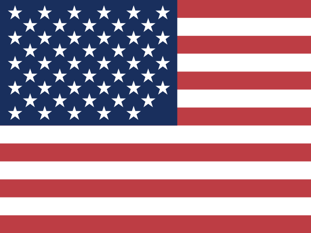
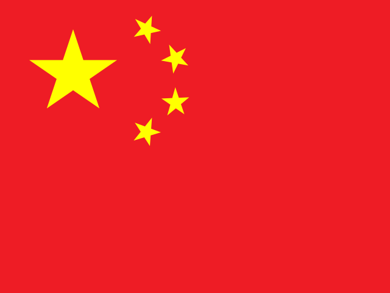

# 🚩 Flagsss

A comprehensive collection of SVG flags for countries and territories. High-quality, lightweight, and easy to use via CDN or local hosting.

## 🚀 Usage

### 1. Via GitHub Pages (Host Anda Sendiri)
Jika Anda mengaktifkan GitHub Pages, aset dapat diakses di:
`https://[USERNAME].github.io/flagsss/[iso-code].svg`

### 2. Via CDN (jsDelivr)
Gunakan ini jika Anda tidak ingin mengaktifkan GitHub Pages secara manual.
`https://cdn.jsdelivr.net/gh/[USERNAME]/flagsss@main/[iso-code].svg`

### 3. Contoh Implementasi (HTML)
```html
<!-- Menggunakan GitHub Pages -->


<!-- Menggunakan jsDelivr -->

```

### 4. Local Usage
Copy the `.svg` files to your project's assets folder and reference them locally:
```html

```

---

## 🌎 Available Flags

Below is a partial list of available flags. Most filenames follow the **ISO 3166-1 alpha-2** standard.

| Code | Flag | Preview |
| :--- | :--- | :--- |
| **id** | Indonesia |  |
| **us** | United States |  |
| **gb** | United Kingdom |  |
| **jp** | Japan |  |
| **kr** | South Korea |  |
| **cn** | China |  |
| **de** | Germany |  |
| **fr** | France |  |

> *Check the repository for the full list of 270+ flags.*

---

## 🛠 Features
- **Scalable**: All flags are in SVG format, ensuring sharpness at any size.
- **Lightweight**: Optimized file sizes for fast loading.
- **Naming**: Consistent naming convention (mostly ISO codes).

## 📄 License
Generic License - Feel free to use in your projects.
